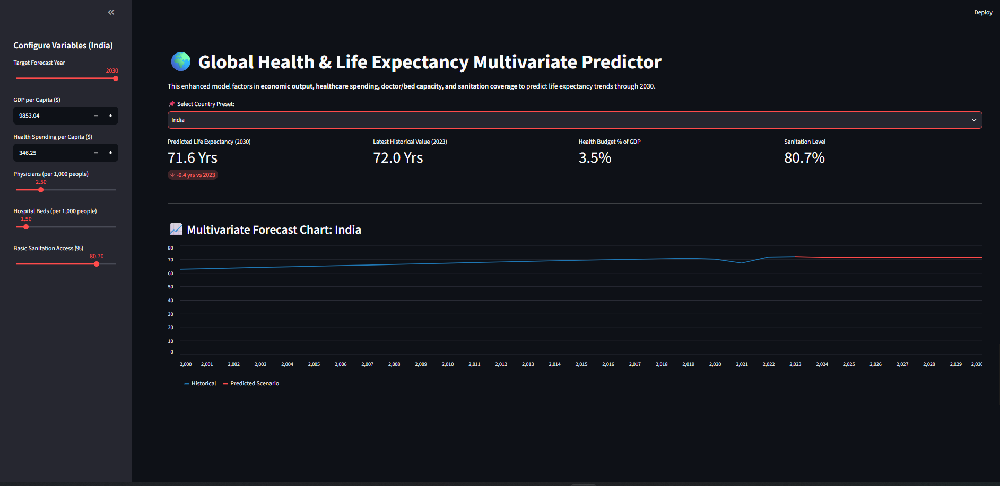

# 🌍 Global Healthcare Analytics & Life Expectancy Predictor

An end-to-end data engineering, analytics, and machine learning framework designed to analyze historical global health metrics and predict country-level life expectancy through 2030 based on economic spending and infrastructure development.



---

## 🚀 Overview & Key Features

*   **API & Raw Data Ingestion:** Automated ingestion of multi-decade demographic and economic datasets from the World Bank API and local CSV metrics.
*   **Relational Database Pipeline:** Cleaned, transformed, and normalized raw data into an optimized SQLite database (`healthcare.db`).
*   **Advanced SQL Merging:** Joined secondary infrastructure and environmental datasets (hospital bed capacity, sanitation coverage) directly into the SQL relational schema to eliminate omitted variable bias.
*   **Exploratory Visualizations:** Automated EDA pipelines generating cross-country comparison charts and long-term trends.
*   **Machine Learning Tournament:** Trained and evaluated multiple regression algorithms—selecting an **Extra Trees Regressor** coupled with `KNNImputer` and `StandardScaler` to handle missing historical metrics cleanly.
*   **Interactive Simulation Dashboard:** A live Streamlit web application enabling real-time scenario testing and life expectancy trajectory forecasting up to 2030.

---

## 📂 Project Structure

```text
healthcare-analytics-project/
├── data/
│   ├── life-expectancy-vs-health-expenditure.csv
│   ├── life-expectancy-vs-health-expenditure.metadata.json
│   └── readme.md
├── database/
│   └── healthcare.db                      # Centralized SQLite database
├── notebooks/
│   ├── 01_load_to_sql.ipynb               # World Bank API extraction & DB loading
│   ├── 02_merge_new_data.py               # SQL database merging script for new metrics
│   ├── 02_sql_analysis.ipynb              # Relational SQL query exploration
│   ├── 03_visualizations.ipynb            # EDA visualization pipeline
│   ├── 04_multi_country_analysis.ipynb    # Cross-nation demographic comparative analysis
│   └── 05_machine_learning.ipynb          # Model evaluation, tuning & tournament
├── .gitignore
├── app.py                                 # Streamlit dashboard application
├── argentina_health_trend.png             # Single-country health trajectory EDA
├── best_ml_model_performance.png          # Model benchmarking visual
├── champion_ml_model_performance.png      # Winner evaluation metrics
├── dashboard_preview.png                  # Interactive web UI screenshot
├── global_health_comparison.png           # Multi-country scatter/trend comparison
├── ml_prediction_accuracy.png             # Residuals and accuracy assessment plot
└── README.md                              # Project documentation