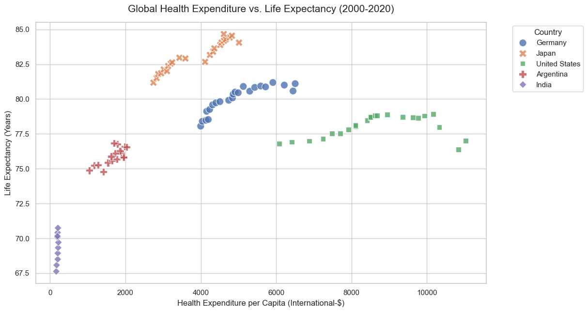
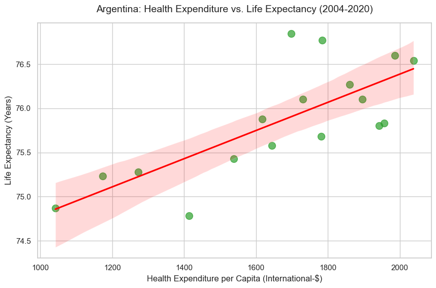

# Healthcare Analytics: Life Expectancy vs. Health Expenditure

## Project Overview
This project analyzes the historical relationship between a country's health expenditure per capita and the average life expectancy of its citizens. The goal is to determine if higher financial investment in healthcare directly correlates with better health outcomes across different global economies.

**Data Source:** Our World in Data / OECD Health Expenditure and Financing Database (2023). Health expenditure is measured in international-$ at 2015 prices to adjust for inflation and purchasing power parity.

## Tech Stack
* **Language:** Python
* **Database:** SQLite
* **Data Processing:** Pandas
* **Visualization:** Matplotlib, Seaborn

## Key Insights
1. **General Correlation:** For developing and middle-income nations (e.g., India, Argentina), increased health expenditure demonstrates a strong positive correlation with rising life expectancy.
2. **The Efficiency Gap (The U.S. Outlier):** The data reveals a significant efficiency gap in the United States. Despite spending drastically more per capita than any other analyzed nation (frequently exceeding $8,000 - $10,000+), the U.S. life expectancy remains lower than nations like Japan and Germany, which spend approximately half as much but achieve life expectancies in the 80+ year range.

## Visualizations

### Multi-Country Comparison (2000-2020)

### Argentina Case Study (2004-2020)

## Project Structure
* `data/`: Contains the raw CSV and JSON metadata files (Ignored in remote repository for size efficiency).
* `database/`: Contains the local `healthcare.db` SQLite database (Ignored in remote repository).
* `notebooks/`: 
  * `01_load_to_sql.ipynb`: Ingests the raw CSV and builds the SQLite database.
  * `02_sql_analysis.ipynb`: Executes SQL queries to extract targeted analytical datasets.
  * `03_visualizations.ipynb` & `04_multi_country_analysis.ipynb`: Generates the seaborn scatter plots.

## How to Run Locally
1. Clone this repository.
2. Download the raw dataset from [Kaggle / Our World in Data](https://www.kaggle.com/datasets/sndorburian/life-expectancy-vs-health-expenditure) and place the CSV in the `data/` folder.
3. Run the Jupyter Notebooks in sequential order to build the local database and generate the charts.